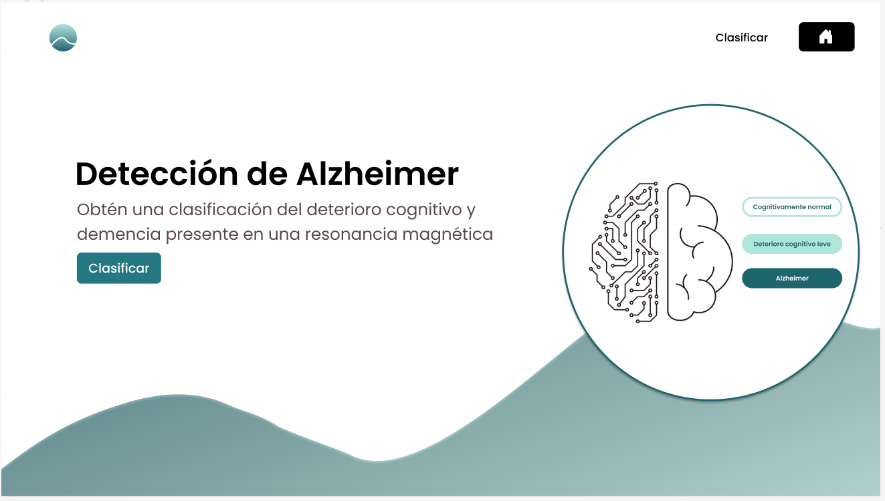
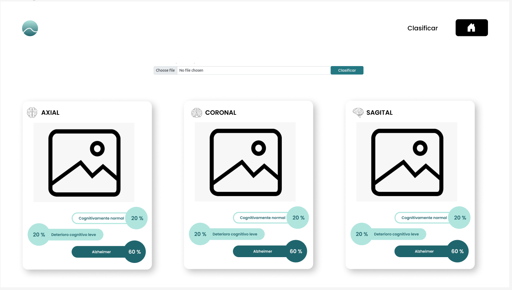
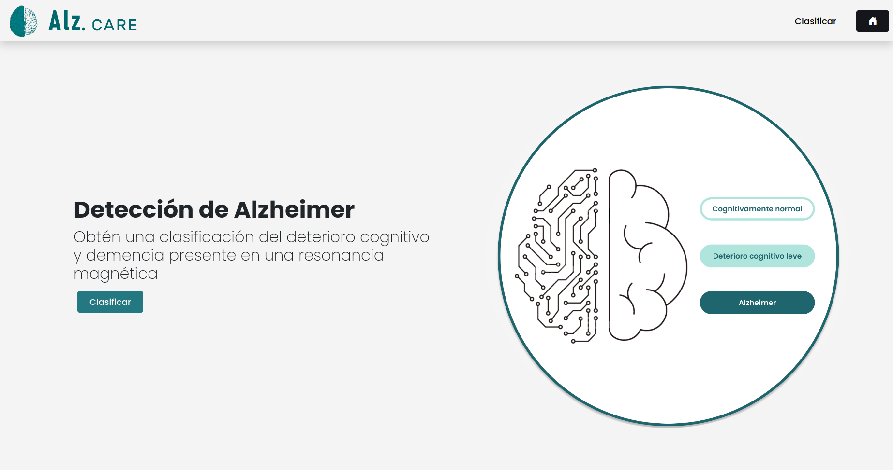
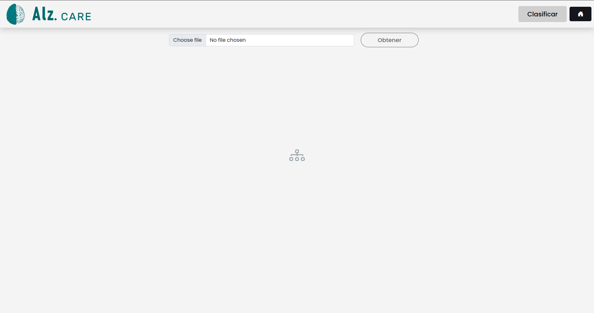
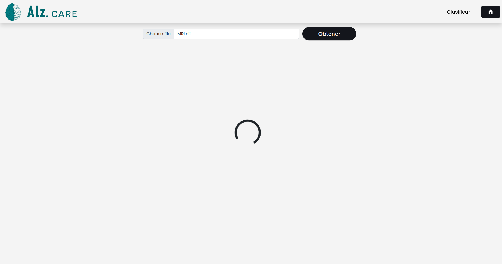
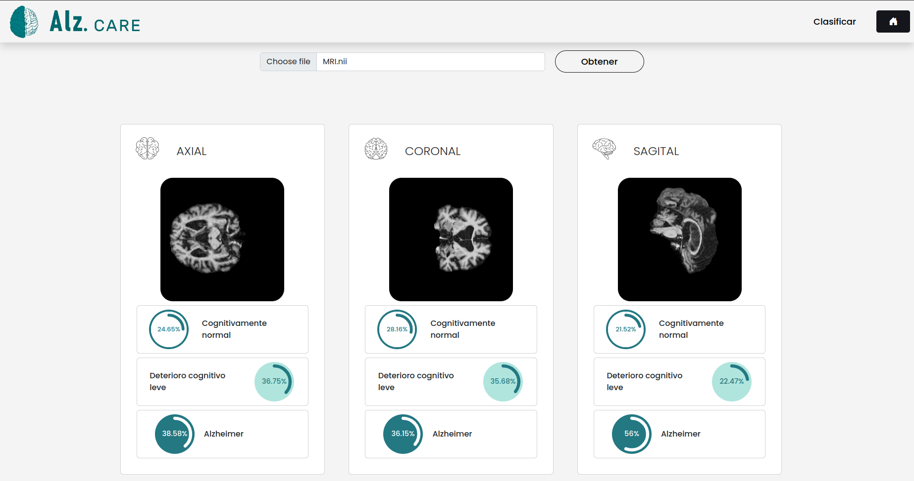

# Alz Care

Se propone esta app como la aplicación de un sistema de aprendizaje profundo a partir de Imágenes por Resonancia 
Magnética en un ejemplo de uso real.

Proyecto: 
**Alz Care**

Descripción: 

**Se idea Alz Care para ser una aplicación que una inteligencia artificial y salud, en ella a partir de un IRM y se obtiene 
una clasificación del deterioro cognitivo y demencia presente en ella**

### Identidad visual:

|                                Logo                                 |                               Nombre                                |
|:-------------------------------------------------------------------:|:-------------------------------------------------------------------:|
|  |  | 

### Proceso de Diseño 

#### UX Design

|                             Home Page                              | 
|:------------------------------------------------------------------:|
|  |

|                             Classification Page                              | 
|:----------------------------------------------------------------------------:|
|  |

## Tecnologías

### Backend: Api
   - Flask
   - Flask smorest y marshmallow
   - Poetry para dependencias
   - Swagger: API doc

### Frontend:
   - React 

## Metodología

  - Desarrollo Agile
  - Tools: Git Hub Projects Board
  - Integración continua:
    - **Backend:**
        - flake8
        - Tests
        - Note: poetry para dependencias
    - **Frontend:**
      - Prettier
      - Tests

## Demo

Final results v.1

|                                Home Page                                | 
|:-----------------------------------------------------------------------:|
|  |

|                          Classification Page                           | 
|:----------------------------------------------------------------------:|
|  |

|                       Classification Page Loading                        | 
|:------------------------------------------------------------------------:|
|  |

|                       Classification Page Results                        | 
|:------------------------------------------------------------------------:|
|  |