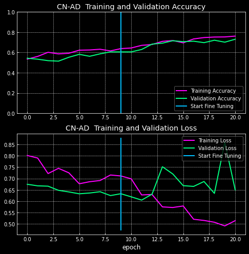
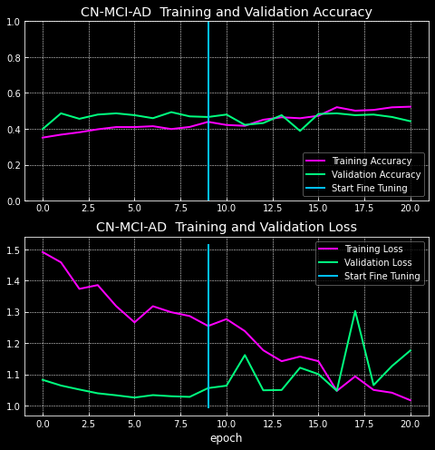
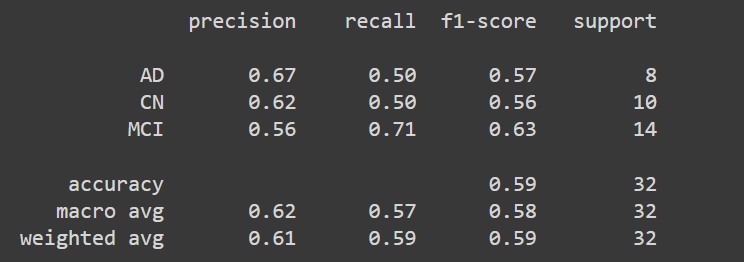
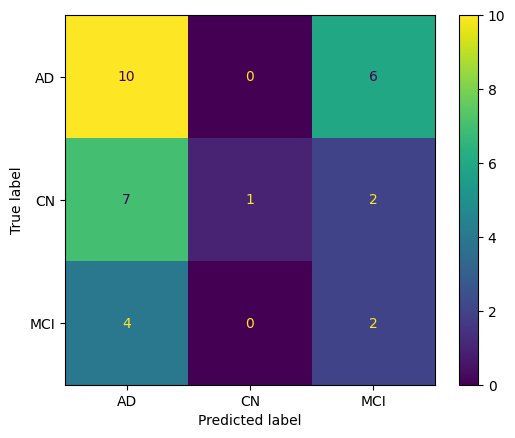

## Desarrollo experimental

Tras una previa investigación del estado del arte en el que re recoge:
  - Transfer learning es la mejor técnica.
  - Los datasets balanceados ofrecen mejores resultados.
  - La prueba más frecuente para el diagnóstico del Alzheimer es la Imagen por Resonancia Magnética.
  - No se clarifica qué plano (axial, coronal o sagital) es mejor utilizar.
  - No se realizan comparativas entre precisiones según distinto número de clases.

Se propone desarrollar un sistema de aprendizaje profundo a partir de Imágenes por Resonancia Magnética con el cual:
  - Realizar un análisis sobre que plano ofrece mejores resultados (teniendo en cuenta que las redes neuronales de 3
dimensiones requieren de una capacidad computacional muy alta)
  - Realizar una comparativa de clasificación entre 2 y 3 clases, (CN-MCI-AD y CN-AD)

Se usa Efficientnetb7 ya que según la documentación de keras, es el modelo pre-entrenado que ofrece con mayor nivel
de accuracy. 

## Conclusión vista Axial

### Output:

|                        CN vs AD                         |                       CN vs MCI vs AD                       |
|:-------------------------------------------------------:|:-----------------------------------------------------------:|
|  |  | 

### Classification Report:

|                      CN vs AD                       |                     CN vs MCI vs AD                     |
|:---------------------------------------------------:|:-------------------------------------------------------:|
|  |  | 

### Confusion Matrix:

|                      CN vs AD                       |                     CN vs MCI vs AD                     |
|:---------------------------------------------------:|:-------------------------------------------------------:|
|  |  | 

## Conclusión vista Coronal

### Output:

|                         CN vs AD                          |                       CN vs MCI vs AD                       |
|:---------------------------------------------------------:|:-----------------------------------------------------------:|
|  |  | 

### Classification Report:

|                      CN vs AD                       |                     CN vs MCI vs AD                     |
|:---------------------------------------------------:|:-------------------------------------------------------:|
|  |  | 

### Confusion Matrix:

|                      CN vs AD                       |                     CN vs MCI vs AD                     |
|:---------------------------------------------------:|:-------------------------------------------------------:|
|  |  | 

## Conclusión vista Sagital

### Output:

|                         CN vs AD                          |                       CN vs MCI vs AD                       |
|:---------------------------------------------------------:|:-----------------------------------------------------------:|
|  |  | 

### Classification Report:

|                      CN vs AD                       |                     CN vs MCI vs AD                     |
|:---------------------------------------------------:|:-------------------------------------------------------:|
|  |  | 

### Confusion Matrix:

|                      CN vs AD                       |                     CN vs MCI vs AD                     |
|:---------------------------------------------------:|:-------------------------------------------------------:|
|  |  | 

# Conclusión

Con la vista coronal se obtienen notablemente mejores resultados (más del 80% de accuracy).

La diferencia entre CN-MCI y MCI-AD es pequeña y sumado a que no un conjunto de datos extenso sobre el que poder 
obtener un dataset completo producen una precisión baja.