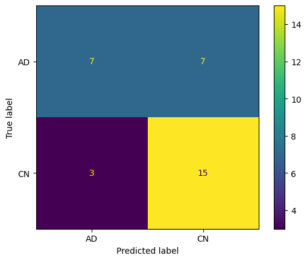
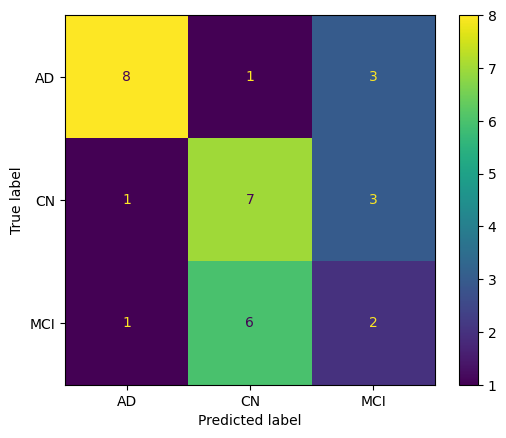
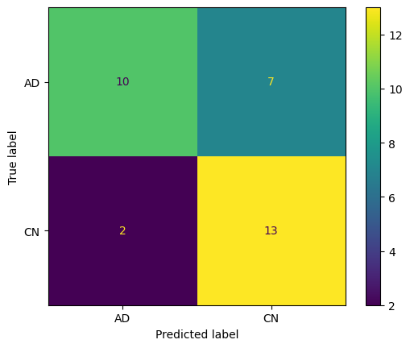
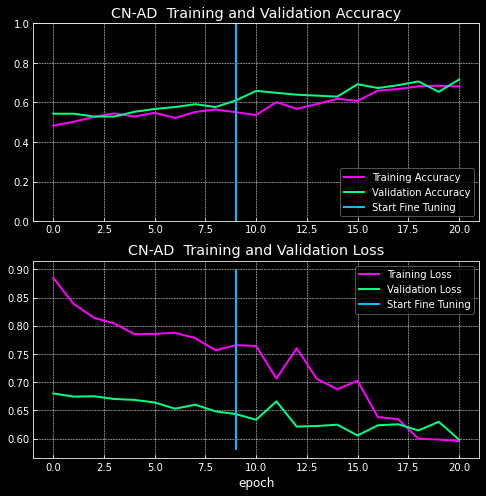
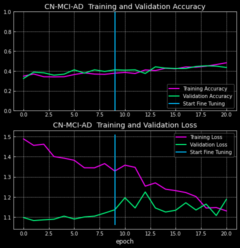
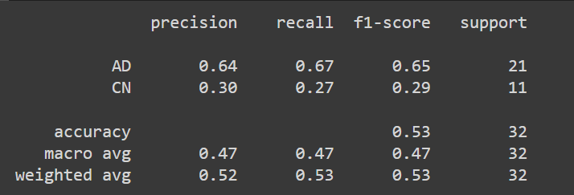

## Análisis y Desarrollo Experimental

Tras la investigación del estado actual de la literatura en este ámbito, se recopilan los siguientes puntos sobre el DL
para clasificación de la EA:

- El Transfer Learning es la mejor técnica de entrenamiento.
- Los datasets balanceados ofrecen mejores resultados, y más fiables, en la clasificación de imágenes, pero la limitación de disponibilidad de biomarcadores del seguimiento de la EA puede suponer un obstáculo.
- La prueba más frecuente para el diagnóstico de la enfermedad es la MRI.
- No se clarifica qué plano cerebral (axial, coronal o sagital) es mejor utilizar y bajo qué diferencias de rendimiento.
- No se realizan comparativas de rendimiento entre distinto número de clases.

Se propone desarrollar un sistema de aprendizaje profundo a partir de MRI con el cual:

- Realizar un análisis sobre qué plano cerebral ofrece mejores resultados en el diagnóstico de la EA, ya que se tiene en cuenta que las redes neuronales de 3 dimensiones requieren de una capacidad computacional muy alta.
- Realizar una comparativa del rendimiento de la clasificación entre 2 y 3 clases: Cognitivamente normal frente a Alzheimer y cognitivamente normal frente a deterioro cognitivo leve frente Alzheimer.

## Conclusión vista Axial

### Output:

|                        CN vs AD                         |                       CN vs MCI vs AD                       |
|:-------------------------------------------------------:|:-----------------------------------------------------------:|
|  |  | 

### Classification Report:

|                      CN vs AD                       |                     CN vs MCI vs AD                     |
|:---------------------------------------------------:|:-------------------------------------------------------:|
|  |  | 

### Confusion Matrix:

|                      CN vs AD                       |                     CN vs MCI vs AD                     |
|:---------------------------------------------------:|:-------------------------------------------------------:|
|  |  | 

## Conclusión vista Coronal

### Output:

|                         CN vs AD                          |                       CN vs MCI vs AD                       |
|:---------------------------------------------------------:|:-----------------------------------------------------------:|
|  |  | 

### Classification Report:

|                      CN vs AD                       |                     CN vs MCI vs AD                     |
|:---------------------------------------------------:|:-------------------------------------------------------:|
|  |  | 

### Confusion Matrix:

|                      CN vs AD                       |                     CN vs MCI vs AD                     |
|:---------------------------------------------------:|:-------------------------------------------------------:|
|  |  | 

## Conclusión vista Sagital

### Output:

|                         CN vs AD                          |                       CN vs MCI vs AD                       |
|:---------------------------------------------------------:|:-----------------------------------------------------------:|
|  |  | 

### Classification Report:

|                      CN vs AD                       |                     CN vs MCI vs AD                     |
|:---------------------------------------------------:|:-------------------------------------------------------:|
|  |  | 

### Confusion Matrix:

|                      CN vs AD                       |                     CN vs MCI vs AD                     |
|:---------------------------------------------------:|:-------------------------------------------------------:|
|  |  | 

# Conclusión

Para empezar hay que concluir que la evolución de los modelos durante el entrenamiento es muy similar.
En ninguno de los casos se obtiene una precisión mayor al 80%.
Y además la tendencia de la función de pérdida es un indicador de que quizás haría falta un mayor número de muestras de
entrenamiento.

En este caso hemos utilizado el mayor número posible de las disponibles creando un dataset balanceado.
Sería interesante plantear una nueva vertiente en la que se mezclen biomarcadores de varias fuentes de datos como hacen
algunos estudios de la literatura, y como también se intentó en un principio en este proyecto, pero los requerimientos
de acceso a tales repositorios de datos es otro impedimento.

En cuanto a la pregunta que marca el objetivo de este proyecto. ¿Qué plano es mejor para el diagnóstico del
Alzheimer? Claramente, teniendo en mente el valor de la precisión, en el plano coronal un mayor porcentaje
de datos han sido etiquetados de forma correcta que en el resto de planos tanto en la comparativa de 2 clases como
en la comparativa de 3 clases.

Además el plano coronal anatómicamente engloba las tres regiones más importantes del cerebro relacionadas con la EA:
el hipocampo, la corteza y los ventrículos.
Por lo tanto, con los datos que se han obtenido se puede concluir que sí es el mejor plano para el diagnóstico de la
enfermedad.

Además, con este sistema se podrían integrar los tres los tres modelos de manera que, una vez que se ha realizado
la clasificación usando cada plano, realizar un diagnóstico por votación siendo el resultado final el más votado de la
unión de los resultados de los tres modelos.
